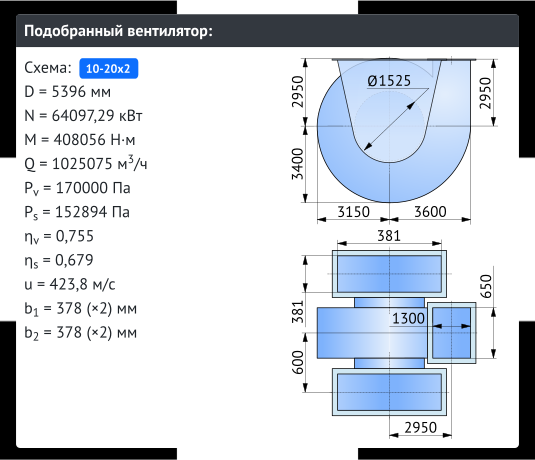
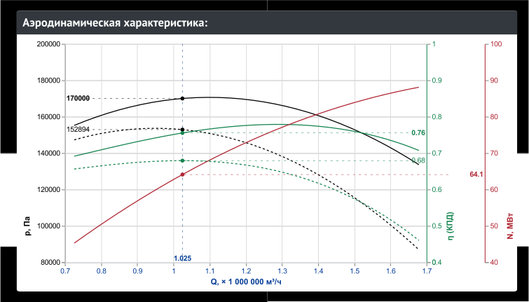
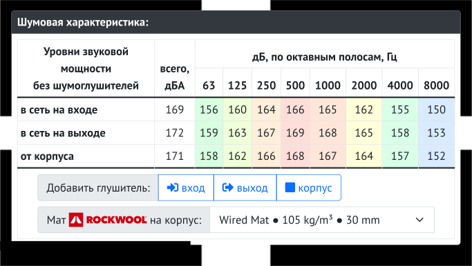
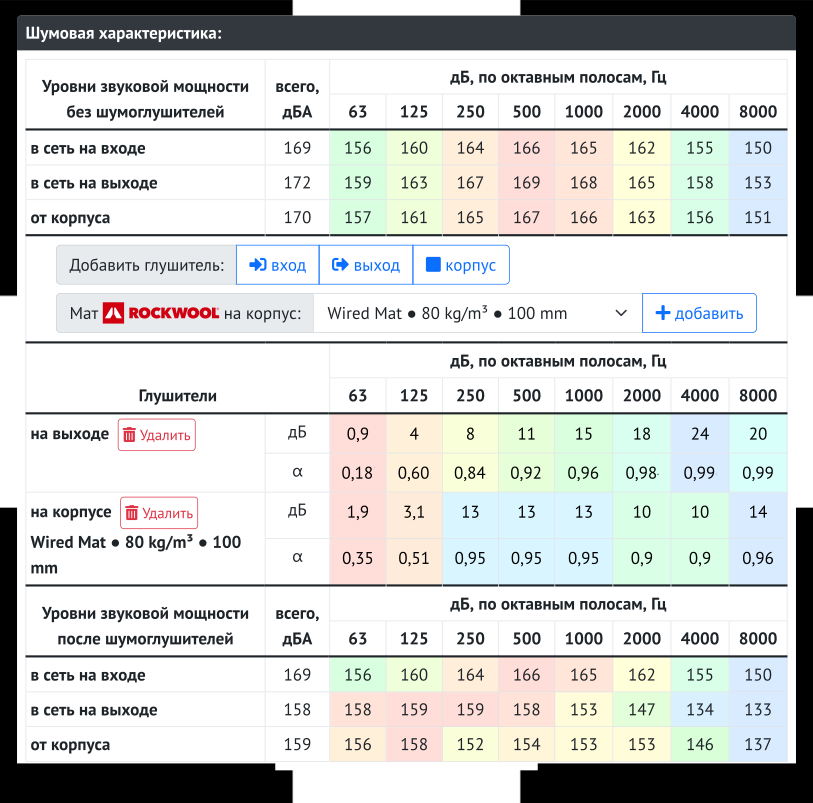

# fantune-frontend
Custom fans. Frontend.

Deployed at http://31.134.181.226:58000.

Sorry. Only Russian language yet. Maybe later.

Sorry. The backend is proprietary yet. Maybe later.

# Возможности
* Подбирает кастомный оптимальный вентилятор под ваши параметры.
* Даёт аэродинамическую характеристику в графическом виде и рабочую точку.
* Даёт габаритные размеры в виде эскиза.
* Даёт шумовую характеристику в табличном виде.
* Даёт возможность добавить шумоглушители и шумоизоляцию и увидеть результат до и после.

# Использование

Рабочий сайт размещён на http://31.134.181.226:58000. Попробуйте.

## Подбор


Если навести мышь на какое-либо поле ввода (или на сенсорных устройствах - поставить туда курсор), то появится подсказка с наименованием параметра.

В карточке ```Подбор``` введите требуемые вам параметры вентилятора:
* частоту вращения *n* рабочего колеса
* температуру *t* перемещаемого воздуха[^AirOnly]
* производительность по воздуху *Q*
* полное давление *P<sub>v</sub>*
* опцию двустороннего всаса

[^AirOnly]: В качестве перемещаемой среды приложение считает только воздух. Возможность считать другие среды пока не реализована. Однако вы всё же можете посчитать любую среду, если знаете её плотность. Просто подберите температуру так, чтобы в карточке подбора отобразилась нужная вам плотность *ρ*.

Если заказчик задал плотность, то вы можете проверить, правильно ли он её посчитал, глядя на параметр *ρ*.

Пользуйтесь кнопками ```+``` и ```-``` возле полей ввода значений, если вам нужно понемногу изменять значение параметра. Эти кнопки будут изменять ваше число в соответствии с рядом R160 по стандарту ISO 3.

На основании введённых вами данных приложение считает параметр быстроходности *n<sub>y</sub>*. Это базовый параметр для всего расчёта. В зависимости от его значения выбирается конкретная *аэродинамическая схема*. Если же значение быстроходности *n<sub>y</sub>* выходит за установленный диапазон, то приложение выдаст явный отказ от расчёта и предложит способы вернуть значение быстроходности в требуемый диапазон.

> *Аэродинамическая схема* или просто *схема* - конкретная геометрия вентилятора и соответствующие конкретные числовые характеристики. Причём геометрия и характеристики выражены в безразмерных величинах. В рамках одной схемы конкретные вентиляторы отличаются друг от друга простым масштабированием размеров.

При включённой опции *Двусторонний всас* допустимый диапазон быстроходности отличается в большую сторону от обычного одностороннего режима. Если ваш запрос даёт слишком большую быстроходность, попробуйте двусторонний вариант.

Приложение будет сохранять введённые вами данные в локальном хранилище браузера, так что если на этом компьютере и в этом браузере вы откроете приложение вновь, то в него будут вбиты данные, которые были в нем во время последнего визита на сайт.

При изменении данных все результаты пересчитываются немедленно. Никаких дополнительных действий для пересчёта предпринимать не нужно.

## Подобранный вентилятор



В карточке ```Подобранный вентилятор``` мы наблюдаем общие характеристики и габаритный эскиз оптимального под ваш запрос вентилятора.

Если вам не ясно буквенное обозначение какой-либо величины, то наведите на неё курсор мыши (или на сенсорных устройствах - коснитесь её пальцем) и получите подсказку с наименованием величины.

Если нужно сохранить картинку габаритного эскиза, то кликните по ней правой кнопкой мыши (или на сенсорных устройствах - долгое прикосновение пальцем) и сохраните файл для последующей вставки в ваши документы.

Для передачи вентилятора в разработку достаточно назвать имя схемы и диаметр колеса ***D***.

## Аэродинамическая характеристика



В карточке ```Аэродинамическая характеристика``` для подобранного вентилятора видим график зависимости от производительности по воздуху *Q* следующих величин:
* полное давление *P<sub>v</sub>* (чёрная сплошная)
* статическое давление *P<sub>s</sub>* (чёрная пунктирная)
* полный КПД *η<sub>v</sub>* (зелёная сплошная)
* статический КПД *η<sub>s</sub>* (зелёная пунктирная)
* механическая мощность на валу рабочего колеса *N* (красная сплошная)

Шкалы физических величин по цвету совпадают с соответствующими кривыми.

На каждой кривой круглой точкой отмечена рабочая точка вентилятора, соответствующая запрошенным вами параметрам. Рабочие точки пунктирами спроецированы на шкалы и там отмечены числовые значения величин. Это те же значения, которые мы видим в карточке ```Подобранный вентилятор```.

Если нужно сохранить картинку графика, то кликните по нему правой кнопкой мыши (или на сенсорных устройствах - долгое прикосновение пальцем) и сохраните файл для последующей вставки в ваши документы.

## Шумовая характеристика



Математический метод оценки шума, применяемый в приложении, довольно груб, но зато ошибается всегда в большую сторону.

Шум, выдаваемый вентилятором, подразделяется на три ***направления***:
* шум на входе - то есть отдаваемый во входной воздуховод, если таковой присоединён
* шум на выходе - то есть отдаваемый в выходной воздуховод, если таковой присоединён
* шум от корпуса, излучаемый в окружающее пространство и усреднённый по всем направлениям, причём зависимость этого шума от наличия присоединённых воздуховодов пренебрежимо мала

По каждому ***направлению*** шумовая характеристика представлена двумя видами:
* в дБ по октавным полосам (радужная заливка ячеек) - чистая некорректированная звуковая мощность, может быть использована для последующего подбора противошумовых мер, в том числе за пределами этого приложения
* в дБА, всего - суммированная и корректированная по характеристике А согласно ISO 3744, выражает уровень дискомфорта человека и влияние на здоровье, может быть использована для оценки допустимости применения вентилятора в соседстве с людьми согласно действующим нормам охраны здоровья и труда

Применяемые способы численного выражения шума соотвествуют ISO 3744 и ISO 3746.

## Противошумовые меры



